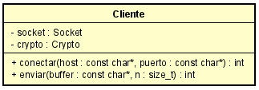

# TP1 - Crypto Sockets

- Materia: Taller de Programación I (75.42)
- Año y cuatrimestre: 2°C 2020
- Alumno: Biancardi, Julián
- Padrón: 103945
- [Link al repositorio](https://github.com/JulianBiancardi/tp1)
- [Link al enunciado](http://206.189.71.102:8080/course/2020c2/ej1/enunciado.pdf)

# Indice   
1. [Introducción](#id1)
2. [Especificaciones](#id2)
3. [Restricciones](#id3)
4. [Desarrollo](#id4)
5. [Errores](#id5)
6. [Conclusiones](#id6)

## 1. Introducción<a name="id1"></a>
En el siguiente informe se detallara todos los pasos seguidos para la resolucion del trabajo practico 1 de la materia Taller de Programacion 1, como asi tambien los detalles de implementacion. 

El mismo consiste en una comunicacion cifrada, mediante distintos tipos de algoritmos de clave simetrica, entre un emisor(cliente) y un receptor(servidor). Los datos solamente seran en sentido emisor->receptor(cliente->servidor) y serán ni más ni menos que el mensaje cifrado.

Para esta comunicacion se usara el protocolo TPC/IP.

## 2. Especificaciones<a name="id2"></a>

2.1 Servidor

Primero debe abrirse un servidor especificandole el puerto, utilizando el protocolo TCP.

- Formato de línea de comando

        El servidor debe ser invocado con la siguiente linea de comando:

        ./server <puerto> --method=<method> --key=<key>

        Donde el puerto es aquel donde se quiere abrir el servidor.

2.2 Cliente

El cliente debera conectarse a un host y un puerto, utilizando el protocolo TCP. Los datos a enviar seran por entrada estandar (stdin).

- Formato de línea de comando

        El cliente debe ser invocado con la siguiente linea de comando:

        ./client <host>  <puerto> --method=<value> --key=<value> < archivo

        Donde el host y puerto son donde se quiere conectar. El utimo comando (< archivo) es opcional y nos permitira redireccionar la entrada hacia un archivo.

Para ambos casos el argumento *method* podrá recibir los siguientes valores:
- cesar
- vigenere
- rc4 

El argunmento *key* es la calve del propio metodo.

Los argumentos siempre se recibirán en ese orden, y debido a que todos los metodos son de clave simetrica, tanto el cliente como el servidor deberan ingresar el mismo metodo y misma clave. En caso de no suceder esto ultimo, el mensaje recibido por el servidor no sera correcto.

## 3. Restricciones<a name="id3"></a>

La siguiente es una lista de restricciones técnicas exigidas por el cliente:
1. El sistema debe desarrollarse en ISO C (C99) / ISO C++11.
2. Está prohibido el uso de **variables y funciones globales**.
3. Todo socket utilizado en este TP debe ser **bloqueante** (es el comportamiento por defecto).
4. Las funciones deben ser **cortas** (idealmente de menos de 10 líneas) y el código claro.
5. El archivo de entrada se debe leer en **chunks de 64 Bytes**, usando el stack.

## 4. Desarrollo<a name="id4"></a>

En este apartado se explicaran a fondo los detalles de implementacion realizados para poder llevar a cabo el trabajo.

### 4.1 Detección de parametros

Primero debemos traducir la linea de comando que se ingresan por consola, es decir, obtener en base a la linea de comando el *metodo* y la *clave* con los cuales se cifrara/descifrara los datos.

Para realizar esto se ha utilizado la función [strchr](https://www.tutorialspoint.com/c_standard_library/c_function_strchr.htm) de la libreria `string.h`. 

El encargado de realizar esta operacion seran tanto *cliente_main* como *servidor_main*.

### 4.2 Lecutra de datos

Si bien para obtener los datos de entrada podríamos utilizar memoria dinámica y leer todo el archivo en una pasada, esto seria ineficiente por lo siguiente:

- Cargar todo el archivo en memoria resulta muy ineficiente en cuanto a utilización de recursos.
- Leer de a 1 byte implica llamar a la *syscall*  read tantas veces como caracteres existan en la entrada de datos, por lo que esto no resulta ser la mejor manera considerando que esta syscall es muy costosa.

Se decide entonces leer el archivo de entrada de a 64 bytes, utilizando para esto un buffer estático de longitud fija. Para esto se genera un TDA `freader`:


Mediante este TDA podremos realizar las siguientes operaciones:

- **iterar**: iteramos el archivo leyendo sets de `64 bytes` (chunks) hasta llegar al fin del mismo (tener en cuenta que si este mismo es NULL se leera de stdin). Por cada lectura realizada la funcion callback es invocada. Esta misma debe tener la siguiente firma:

```C
 void funcion (char* buffer, size_t nleidos, void* contexto)
```
Donde `nleidos` es la cantidad que el freader **pudo** leer del `archivo`. Estos mismos se almacenan en `buffer`. Es importante aclarar que el `freader` **intentara** leer 64 bytes del archivo.

En este trabajo esta funcion es implementada por `cliente_main` como se muestra a continuacion. Vemos que los datos recibidos por el freader son encriptados y enviados por el cliente realizando la primera etapa de la comunicacion:

```C
#define EXITO 0
#define ERROR -1

static int _enviarBuffer(const char* buffer, size_t nleido, void* contexto) {
  cliente_t* cliente = contexto;

  return (cliente_enviar(cliente, buffer, nleido) == ERROR) ? ERROR : EXITO;
}
```

A este punto nos podriamos estar preguntando, ¿Que pasaria se el archivo esta vacio? ¿Que pasaria se el archivo tiene mas de 64 bytes? ¿Que pasaria se el archivo tiene menos de 64 bytes?.

En el caso de que el archivo este vacio, `freader` no leera ningun byte e instantaneamente leera un **EOF** marcando el fin de archivo.
En el caso de que el archivo sea mas grande o mas chico que 64 bytes , `freader` leera sin problemas invocando `funcion` las veces necesarias hasta llegar al fin de archivo.

### 4.3 Cifrados

Una vez que se tiene la lectura del archivo procedemos a cifrar/descifrar los datos mediante los distintos tipos de algoritmos (Cesar, Vigenere , Rc4).

Para realizar esto se opto por crear un TDA `crypto` como se muestra a continuacion:


Debemos inicializarlo con la funcion **crypto_crear** la cual recibira un `metodo` y una `clave`. Estos argumentos pueden ser:
1. metodo = *cesar*: tener en cuenta que este metodo requiere de una clave numerica, por lo que se utilizara la funcion [strol](https://www.tutorialspoint.com/c_standard_library/c_function_strtol.htm).
2. metodo = *vigenere*: la clave es un string.
3. metodo = *rc4*: la clave es un string.

Para todos los casos **no se admitiran claves vacias**, por lo que no se podra inicializar correctamente el `crypto`.
Mediante este TDA podremos realizar las siguientes operaciones:

- **crypto_cifrar**: se cifra N bytes del buffer `mensaje`, guardando el resultado en el buffer `destino`.
- **crypto_descifrar**: se descifra N bytes del buffer `mensaje`, guardando el resultado en el buffer `destino`.

Ambos resultados,tanto el cifrado como el descifrado, estaran dado por el `metodo` y `clave`.

### 4.5 Protocolo TCP/IP

Ya teniendo los datos del archivo, pudiendolos cifrar y descifrar, solamente nos queda el envio de los mismos entre el cliente y el servidor. Para realizar esto ultimo se crean 3 nuevos TDAs, cliente servidor y socket.


Tanto el cliente como el servidor tendran una relacion de agregacion con el socket y a continuacion explicaremos cada uno en detalle.

### 4.5.1 Scoket 

Este TDA tiene como fin que dos procesos independientes puedan comunicarse entre sí y intercambiar cualquier flujo de datos. Para que esto suceda un proceso pueda localizar a otro.Entonces son necesarios:

    Un par de direcciones del protocolo de red (dirección IP, si se utiliza el protocolo TCP/IP), que identifican la computadora de origen y la remota.
    Un par de números de puerto, que identifican a un programa dentro de cada computadora.

Los sockets nos permiten implementar una arquitectura cliente-servidor.


Mediante este TDA podremos realizar las siguientes operaciones:

- **socket_crear, socket_destruir**: necesarios para usar el TDA.
- **socket_bind_listen**:  necesarios si se quiere abrir un servidor
- **socket_aceptar**:  nos permite aceptar conexiones entrantes.
- **socket_conectar**:  nos permite conectarnos a un puerto especifico.
- **socket_enviar, socket_recibir**:  necesarios para el flujo de datos.
- **socket_apagar**: nos permite cerrar los canales de la comunicacion.

Todas las funciones usan manejo de errores por lo que `puertos`,`host`,`etc` vacios o erroneos daran como resultado de la funcion un **ERROR** (ver la seccion Errores).

### 4.5.2 Cliente



Mediante este TDA podremos realizar las siguientes operaciones:

- **cliente_crear, cliente_destruir**: necesarios para usar el TDA.
- **cliente_conectar**:  nos permite conectarnos las direcciones posibles del puerto especificado.
- **cliente_enviar**:  necesarios para el flujo de datos. En este caso el cliente no podra recibir datos desde el servidor.

### 4.5.3 Servidor


Mediante este TDA podremos realizar las siguientes operaciones:

- **servidor_crear, servidor_destruir**: necesarios para usar el TDA.
- **servidor_correr**: nos permite abrir un servidor en el puerto especificado, esperando conexiones entrantes.

#### Detalle de implementacion

La funcion **servidor_correr** realizara un bind y listen en el puerto y host especificado, esperando asi conexiones entrantes.Una vez que se presente una conexion por parte de un cliente, el servidor recibira los datos mediante la funcion **servidor_recibir**. Esta ultima recibira los datos enviado por el cliente hasta que el mismo cierre los canales de comunicacion, identificando que la misma llego a su fin.

### 4.5.4  Modelo 

A continuacion de muestra un diagrama de clases del modelo general implementado, incorporando todos los TDAs antes mencionados para poder visualizar como funcionan en conjunto:


En resumen:

- Freader : TDA encargado de leer los datos ya sea de un archivo o de entrada estandar (stdin).
- Crypto: TDA encargado de cifrar/descifrar datos mediante el algoritmo que se le especifique.
- Cliente : TDA encargado de manejar el flujo del programa `cliente_main` . Este TDA tendría un socket propio, con el que se conectaría al servidor.
- Servidor : TDA encargado de manejar el flujo del programa `servidor_main`. Este TDA tendría dos sockets: un `socket aceptador`, encargo de aceptar conexiones entrantes, y otro `socket peer`, que sería la referencia al socket aceptado una vez que el cliente se conecte. A través del `socket peer` nos comunicamos con el cliente.
- Socket : TDA encargado de manejar el flujo de datos como asi tambien el flujo de las conexiones.

El modelo consta de 5 TDAs ,cada uno con responsabilidades claras y un acoplamiento bajo. Esto es un buen indicio si quisieramos reutilizar los TDAs en otro proyecto.

## 5. Errores<a name="id5"></a>

Para todo el trabajo se opto por los siguientes tipos de retorno:

- `ERROR (-1)`: en caso de haber un error en alguna funcion.
- `EXITO (0)` : en caso de no haber errores.
  
## 6. Conclusiones<a name="id6"></a>

Mediante este trabajo pudimos entender como es que funciona una simple comunicacion entre un cliente y el servidor mediante el protocolo TCP/IP. Aprendimos a aprovechar todo lo posible el stack antes que el heap, para mejorar rendimiento. Aprendimos tambien sobre buenas practicas de programacion como asi tambien sobre las normas de codificacion para tener un codigo mas claro y legible.


# Referencias
[1] Criptografía de Clave Simétrica: https://es.wikipedia.org/wiki/Criptograf%C3%ADa_sim%C3%A9trica

[2] Cifrado de César: https://es.wikipedia.org/wiki/Cifrado_C%C3%A9sar

[3] Cifrado de Vigenere: https://es.wikipedia.org/wiki/Cifrado_de_Vigen%C3%A8re

[4] Rivest Cipher 4: https://es.wikipedia.org/wiki/RC4

[5] Protocolo TCP/IP: https://es.wikipedia.org/wiki/Modelo_TCP/IP
