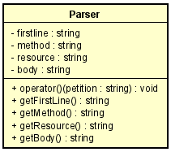
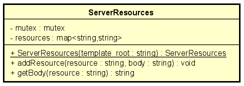
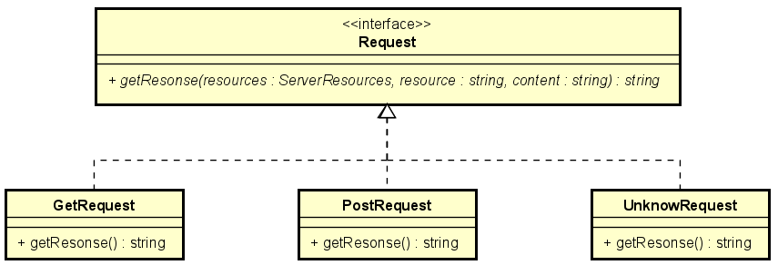
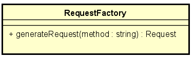
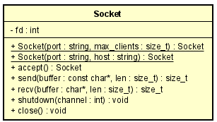
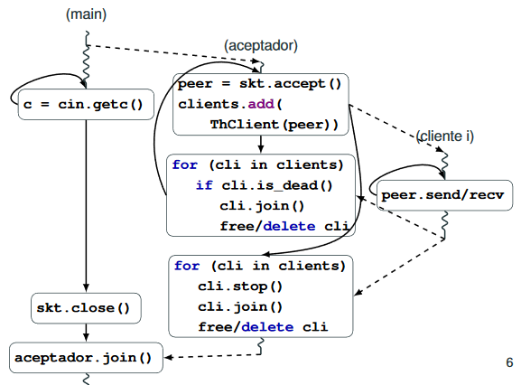
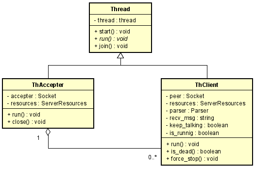
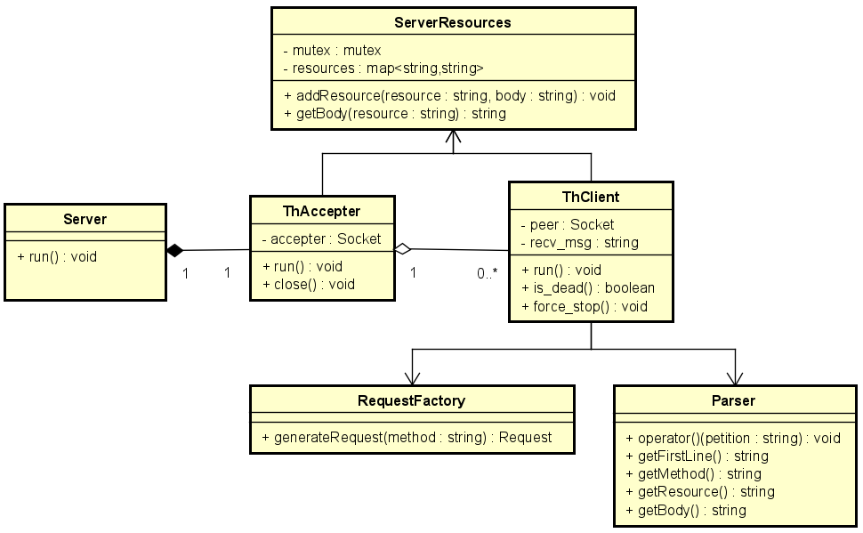
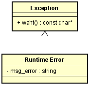
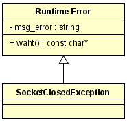

# TP3 - Servidor Multicliente

- Materia: Taller de Programación I (75.42)
- Año y cuatrimestre: 2°C 2020
- Alumno: Biancardi, Julián
- Padrón: 103945
- [Link al repositorio](https://github.com/JulianBiancardi/tp3)

# Indice   
1. [Introducción](#id1)
2. [Especificaciones](#id2)
3. [Restricciones](#id3)
4. [Desarrollo](#id4)
5. [Exepciones](#id5)
6. [Conclusiones](#id6)
7. [Referencias](#id7)

## 1. Introducción<a name="id1"></a>
En el siguiente informe se detallara todos los pasos seguidos para la resolucion del trabajo practico 3 de la materia Taller de Programacion 1, como asi tambien los detalles de implementacion. 

El mismo consiste en la implementacion de un programa servidor multi clientes. El mismo atenderá petitorios HTTP, mediante los cuales podrá acceder y
dar alta a recursos del mismo.

El servidor deberá poder interpretar petitorios HTTP, y extraer de estos los siguientes parámetros:
- Método (GET, POST, etc)
- Ruta del recurso
- Body en caso de que corresponda
  
Utilizando estos parámetros deberá ejecutar la lógica correspondiente y devolver una respuesta también en
formato HTTP

## 2. Especificaciones<a name="id2"></a>

El programa se ejecutará pasando por línea de comandos recibiendo la cantidad de hilos y luego uno o más
archivos:

Servidor
- Formato de línea de comando:

        ./server <puerto/servicio> <root_file>

Donde ​ `puerto/servicio`​ es el puerto TCP (o servicio) el cual el servidor deberá escuchar las conexiones entrantes. El parámetro ​ `template_root` ​ representa la ruta a un archivo con una respuesta para el recurso **“/”**

Cliente

- Formato de línea de comando:

        ./client <ip/hostname> <port/service>

El cliente se conectará al servidor corriendo en la máquina con dirección IP ​ `ip` (o ​ `hostname`​ ), en el puerto (o servicio) TCP ​ `puerto/servicio`​ . Recibirá por entrada standard el texto correspondiente a un petitorio HTTP, el cuál leerá y enviará por socket hasta llegar a EOF. Una vez enviado el petitorio, escuchará la respuesta del servidor e imprimirá por salida standard.

## 3. Restricciones<a name="id3"></a>

La siguiente es una lista de restricciones técnicas exigidas por el cliente:

1. El sistema debe desarrollarse en ISO C++11.
2. Está prohibido el uso de **variables globales**.
3. Se deberá aplicar polimorfismo en la resolución de respuestas del servidor.
4. Se deberá sobrecargar el operador **()​** en alguna clase.
5. Se debe realizar una limpieza de clientes finalizados cada vez que se conecta uno nuevo.

## 4. Desarrollo<a name="id4"></a>

En este apartado se explicaran a fondo los detalles de implementacion realizados para poder llevar a cabo el trabajo.

### 4.1 Parseo del Petitorio

A partir del petitorio enviado por el cliente debemos identificar ciertos argumentos, que componene al mismo, para realizar distintas acciones.

Para realizar esto contamos con la clase `Parser` que contiene las siguientes funcionalidades:



  - **operator()**: a partir de una petición se encargará de obtener los siguientes argumentos necesarios: 
  - `FirstLine` o primera linea del petitorio
  - `Method` o metodo a realizar del petitorio
  - `Resource` o recurso que usará el metodo
  - `Body` o cuerpo del petitorio 


### 4.2 Almacenamiento de Recursos

Aquellos recursos de los distintos petitorios enviados deben ser almacenados para poder luego poder solucionar las tareas a llevar a cabo para los distintos petitorios que se puedan dar en un futuro.

Para realizar esta operación contamos con la clase `ServerResources` que contiene las siguientes funcionalidades:



- **addResource**: agregamos un recurso con su cuerpo correspondiente. Si el recurso es **/** no dará un error debido a que no podemos modificar el root.
- **getBody**: obtenemos el cuerpo del recurso solicitado

Notar que la clase debe construirse con un archivo el cual tendrá el cuerpo para el recurso **/** (root_file).


### 4.3 Respuestas a los distintos Petitorios

Una vez analizado el petitorio, el serivodr deberá enviar una respuesta al cliente. Esta misma estará relacionada con el metodo del petitorio. Por ejemplo, para el metodo *"GET /recurso"* debemos enviarle al cliente el cuerpo del recurso solicitado.

Para esto se ha optado por la siguiente resolución, en la cual tenemos una interfaz `Request` donde los distintos tipos de respuestas implementan:



Escalando esto para tener polimorfismo por parte del servidor (es decir que no conozca los distintos tipos de request) generamos una clase `RequestFactory` que generará la request necesaria para el metodo:



Quedando del lado del servidor de la siguiente forma:

```C
  RequestFactory factory;
  Request* request = factory.generateRequest(parser.getMethod());
  std::string server_msg =
      request->getResponse(resources, parser.getResource(), parser.getBody());
}
```
### 4.4 Comunicación TCP/IP

Para la comunicación entre un cliente y el servidor (1:1) usamos la misma clase `Socket` implementada en el trabajo 1, pero esta vez llevada al lenguaje C++. La misma contiene ls siguientes funcionalidades:



- **Socket(port,max_clients)**: constructor para obtener un servidor en el puerto especificado.
- **Socket(host,port)**: constructor para obtener un cliente conectado al host y puerto.
- **send**: envia N bytes del buffer por el FD.
- **recv**: recive N bytes en el buffer por el FD.
- **shutdown**: apaga el canal solicitado.
- **close**: cierra el socket, apagando ambos canales de comunicación.


### 4.5 Atender a distintos clientes

En este trabajo se debe atender a distintos clientes en simultaneo y enviadole a cada uno su respuesta al petitorio enviado.

Es por esto mismo que no podemos ir por una resolución similar a la del TP1 debido a que en ese caso solo podriamos estar atendiendo a un cliente a la vez.

Entonces mediante la utilización de hilos (threads) realizaremos el siguiente diagrama que consta de dos hilos principales, el **main** y el **aceptador**. El main se encargará de crear el hilo aceptador y esperará por entrada estandar(stdin) el caracter de fin de programa que en este caso es **q**. Por otro lado el hilo aceptador esperará conexiones entrantes y generará un hilo nuevo por cliente estableciendo así la conexión con el mismo. A partir de este punto el cliente y el servidor se comunicarán hasta que el servidor mande la respuesta al petitorio solicitado.

 [1]

Realizando esto tenemos la siguiente clase madre `Thread` de las cuales heredan tanto `ThAccepter` y `ThClient` como se muestra a continuación:




### 4.6  Modelo 

A continuacion de muestra un diagrama de clases del modelo general implementado, incorporando todas las clases antes mencionados para poder visualizar como funcionan en conjunto:




En resumen:

- Parser: Encargado de parsear el petitorio enviado por el cliente.
- ServerResources: Encargado de alamcenar los distintos recursos.
- RequestFactory: Encargado de crear un tipo de Request segun el metodo para enviar las distintas respuestas a los clientes.
- ThClient: Encargado de recibir el petitorio del cliente, procesarlo y enviar una respuesta.
- ThAccepter: Encargado de aceptar nuevos clientes y establecer la comuncacion entre estos y el servidor.
- Server: Encargado de manejar el flujo del programa.


## 5. Exepciones<a name="id5"></a>

Para este trabajo se optó por usar la clase `std::runtime_error` para el manejo de excepciones:

### Runtime Error



Esta clase representa la expeción general. La misma debe construirse con un mensaje de error para luego tener información relevante.

### SocketClosedException



La misma hereda de la clase general `std::runtime_error` antes mencionada y nos sirve para saber cuando el socket fue cerrado. Esto mismo nos resulta util para frenar el **hilo aceptador** cuando el caracter de fin fue ingresado y asi comenzar a cerrar todas las comunicaciones con los clientes activos. 

## 6. Conclusiones<a name="id6"></a>

Mediante este trabajo pudimos implementar un servidor multicliente haciendo uso de los conocimientos previos adquiridos como la programacion en concurrencia. Haciendo buen eso de las buenas practicas de programacion y uso de los beneficios que nos otrogra el lenguaje C++,como lo es RAII, pudimos obtener un codigo preventivo de leaks y de otros disintos posibles errores. Esto nos beneficio debido a que no gastamos tiempo en encontrar errores debugeando, sino que el mismo codigo nos ayuda a prevenirlos de antemano.

## 7. Referencias<a name="id7"></a>

[1] https://raw.githubusercontent.com/Taller-de-Programacion/clases/master/client_server_arch/bin/client_server_arch-handout.pdf

